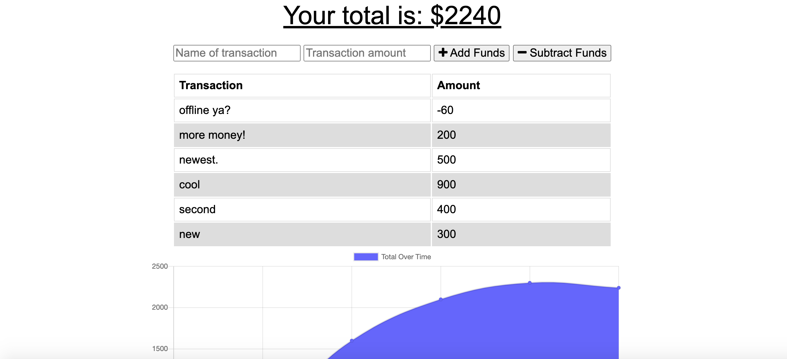
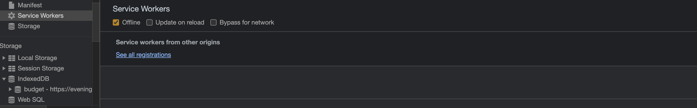
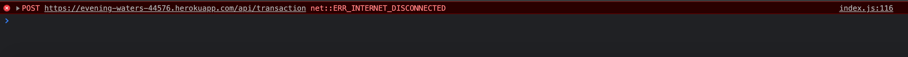
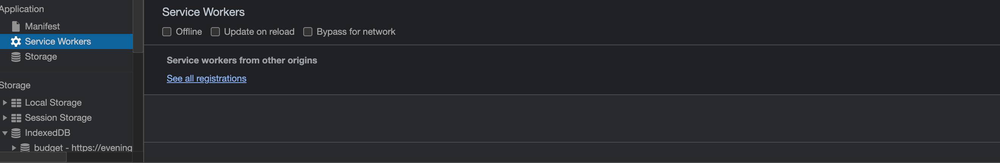
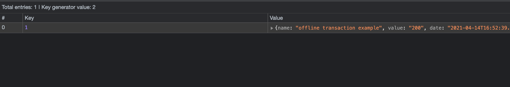

# Budget_Tracker
This application helps track ones budget.  The application can be used on and offline.  This application uses node.js, mongoDB, Mongose and indexedDB in order to set up the database and interact directly witht he server.  The application is ordered up through Heroku and uses mongoDB Atlas to access data.

## Accessing application
The application can be accessed through,

https://evening-waters-44576.herokuapp.com/

## Interfaceing with the application

When the user follows the link to the page they are presented with a set of input boxes for name of transaction, amount of transaction and buttons to descern between adding or subrtracting from the total amount which is presented at the top of the page.  The individual amounts and transaction names are presented under the input areas.  There is also graph that logs all of the transactions since the first (part of the graph is excluded in the picture).

## Offline capability

If the user is not able to access the internet or has gone out of a connection zone, the page is still accessable using indexedDB. In the following images we see the application set to offline in the service worker, then a transaction is made.  It is noted that we see an error in the console. However the transaction is logged on the page.

When the database is viewed in the applications window of our Chrome inspector tool, we see that the information for the transaction is saved.

Once the application is brought back on line the saved object in the database is removed and the information is then saved to the database.

## Supporting Technologies
This application uses
  - node.js
  - mongoDB
  - mongoose
  - mongoDB Atlas
  - indexedDB

npm dependencies include:
  - compression
  - dotenv
  - express
  - lite-server
  - mongoose
  - morgan

## Interested in contributing?
Please feel free to make a pull request and contact the administrator for more information.

## Thank you

Thank you for checking out my page!  Have a great day!
